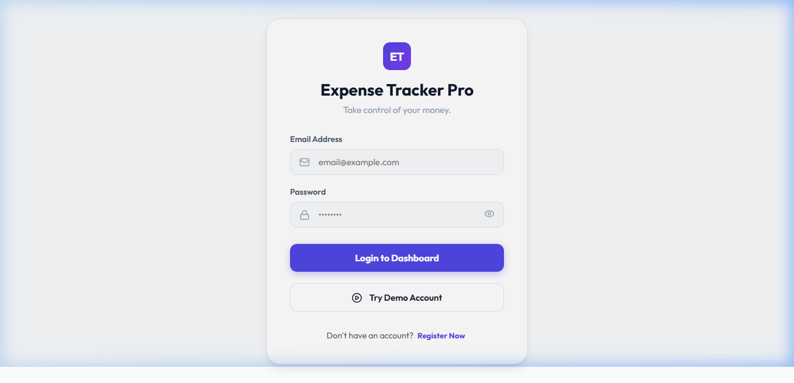
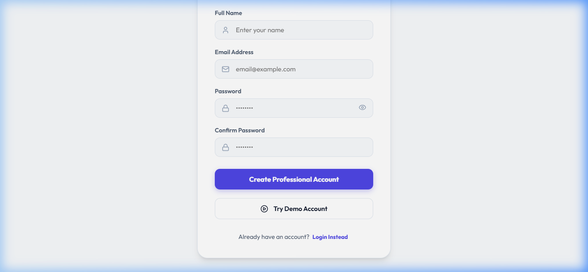
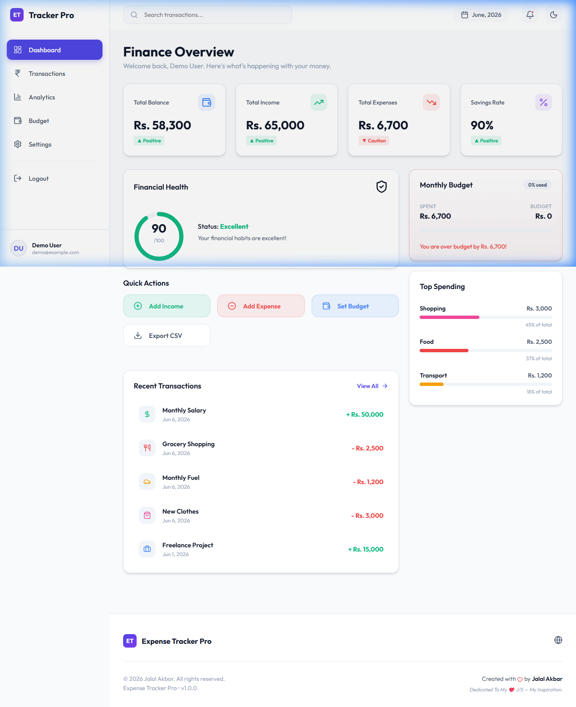
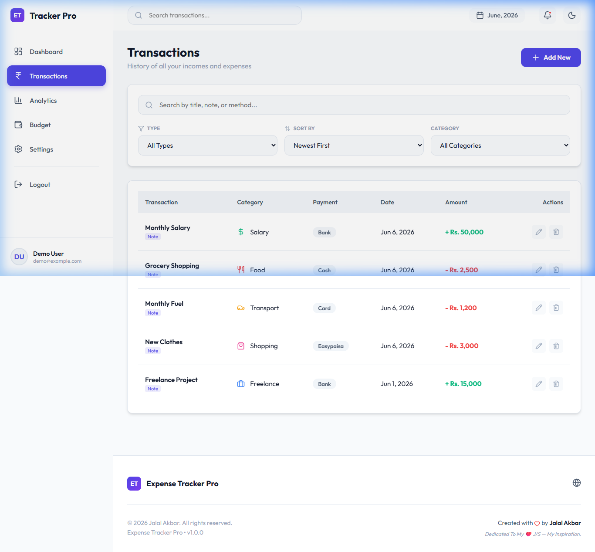
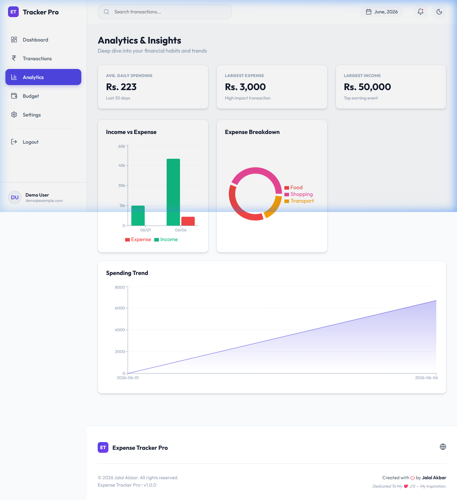
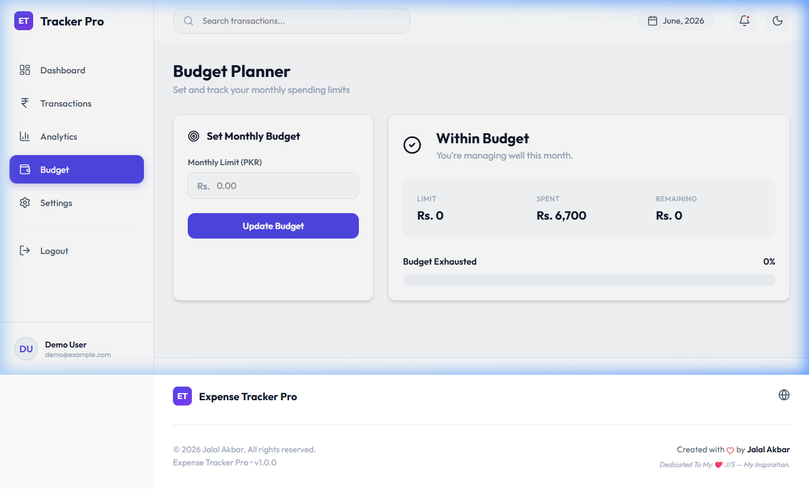
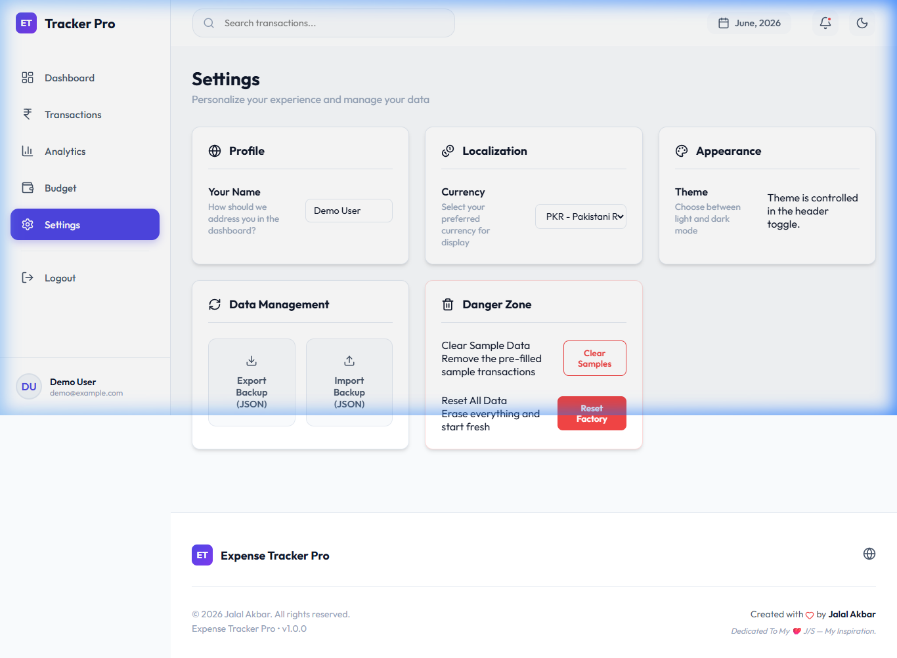

# Expense Tracker Pro 🚀

> A premium, multi-user personal finance SaaS dashboard built with **React.js + Vite**.
> **Repository:** [https://github.com/jalalakbar47/expense-tracker-pro.git](https://github.com/jalalakbar47/expense-tracker-pro.git)

---

## 📸 App Showcase (Light Mode)

### 🔐 Authentication Flow
Capture the premium onboarding experience with our high-conversion forms.

| Login Page | Register Page |
|:---:|:---:|
|  |  |

---

### 📊 Financial Dashboard
The central hub for financial health, tracking, and quick actions.



---

### 💸 Management & Analytics
Deep dive into your spending patterns with specialized views.

| Transactions | Analytics |
|:---:|:---:|
|  |  |

| Budget Planning | System Settings |
|:---:|:---:|
|  |  |

---

## ✨ Features

### 🔐 Multi-User Authentication (New)
- Professional **Login** and **Register** pages with comprehensive field validation.
- Duplicate email prevention and secure password verification.
- Persistent sessions via scoped `localStorage` — data is completely isolated per user.
- **Demo Mode**: Instant access with one click or via `demo@example.com` / `123456`.
- Secure logout integrated into the sidebar.

### 📊 Smart Dashboard
- **Personalized Experience**: Custom greeting and user-aware profile.
- **Live Metrics**: Balance, Income, Expenses, and Savings Rate tracking.
- **Financial Health Score**: Real-time visual indicator of your fiscal status.
- **Recent Activity**: Quick view of latest transactions.
- **Expense Breakdown**: Top categories visualized by importance.

### 💰 Budget & Analytics
- **Visual Budgeting**: Set monthly targets with live progress tracking (Safe/Danger alerts).
- **Deep Insights**: Trend analysis and category breakdowns powered by **Recharts**.
- **Interactive Charts**: Responsive data visualization with custom tooltips.

### ⚙️ Professional Settings
- Multi-currency support and localized date formatting.
- **Data Mobility**: Full JSON backup export and import.
- **Reporting**: One-click CSV export for all transaction records.

---

## 🛠️ Tech Stack

| Technology | Purpose |
|---|---|
| **React 18 + Vite** | High-performance UI framework and modern bundler |
| **Vanilla CSS** | Modular Design System (Layout, Dashboard, Theme, Responsive) |
| **Lucide React** | Premium icon system |
| **Recharts** | Advanced data visualization and charting |
| **localStorage** | Secure client-side persistence and auth isolation |

---

## 🏗️ Project Architecture

```text
src/
├── components/     # Feature-based components (dashboard, transactions, layout, etc.)
├── data/           # Category schemas and sample seed data
├── pages/          # Full-page views and page-level logic
├── styles/         # Consolidated CSS architecture (variables, common, responsive)
├── utils/          # Core utilities (auth, calculations, csv, date formatting)
├── App.jsx         # App routing and global state provider
└── main.jsx        # Entry point
```

---

## 🚀 Getting Started

1. **Clone the repository**
   ```bash
   git clone https://github.com/jalalakbar47/expense-tracker-pro.git
   cd expense-tracker-pro
   ```

2. **Install dependencies**
   ```bash
   npm install
   ```

3. **Run development server**
   ```bash
   npm run dev
   ```

4. **Build for production**
   ```bash
   npm run build
   ```

---

## 🔐 Security Note

> [!IMPORTANT]
> This application uses a **frontend-only authentication system** specifically for showcase purposes.
> User data is stored locally in the browser's `localStorage` using email-prefixed keys. 
> For a production deployment, a secure backend with password encryption and JWT sessions is required.

---

## ❤️ Dedication

Designed and built with passion by **Jalal Akbar**.

*Dedicated to my father, **M. Akbar** — my greatest inspiration. This project reflects the values of hard work and excellence he instilled in me.*

---

## 📄 License

MIT License — Designed with ❤️ for professionals.
