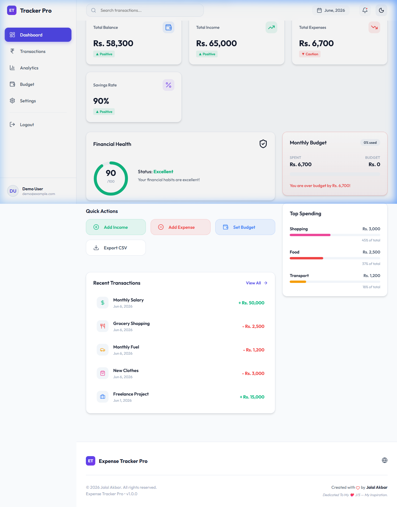
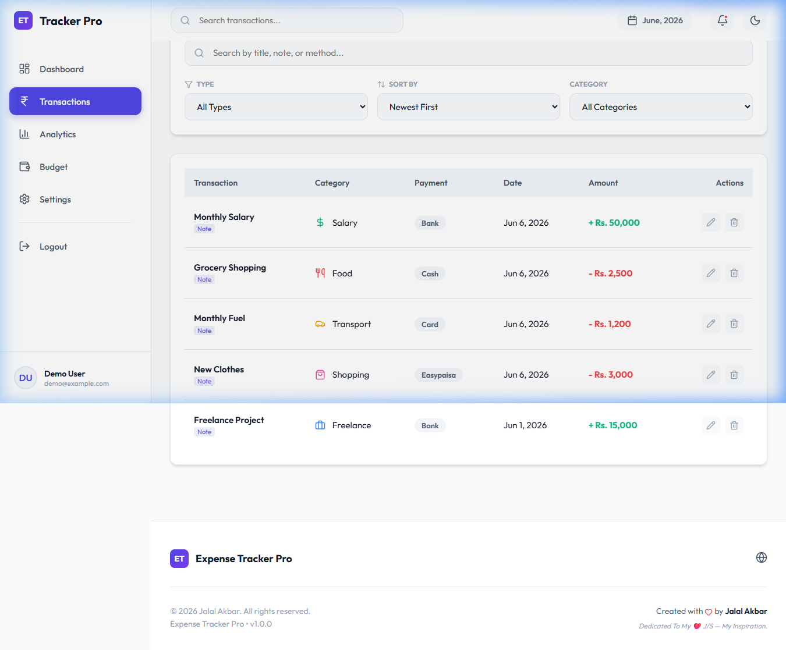
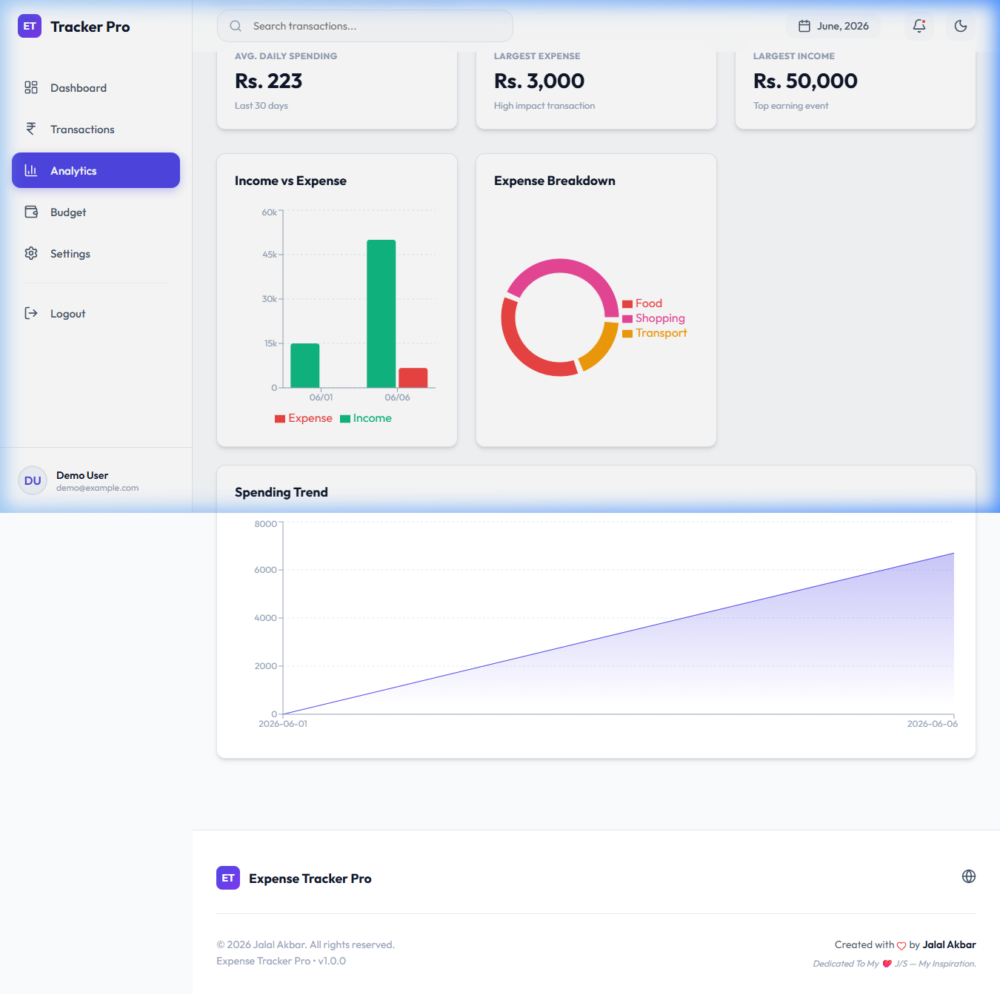
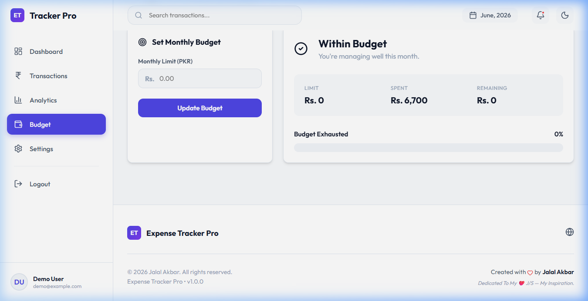
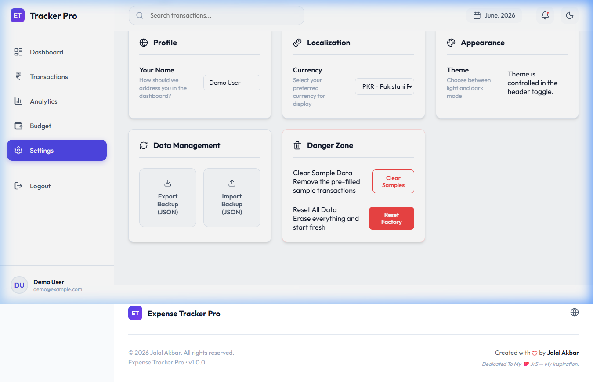
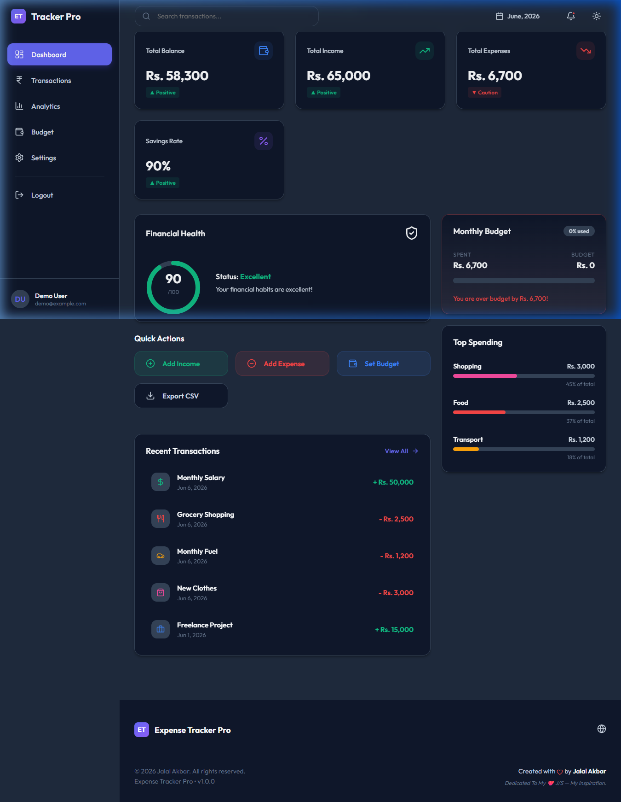
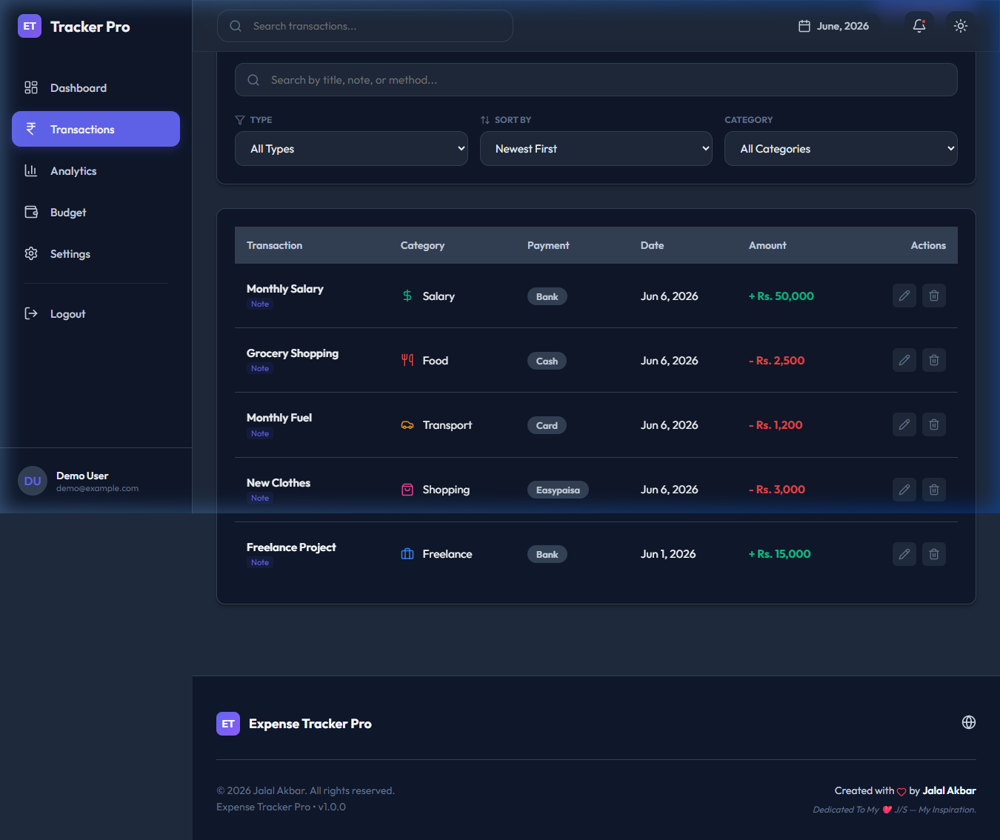
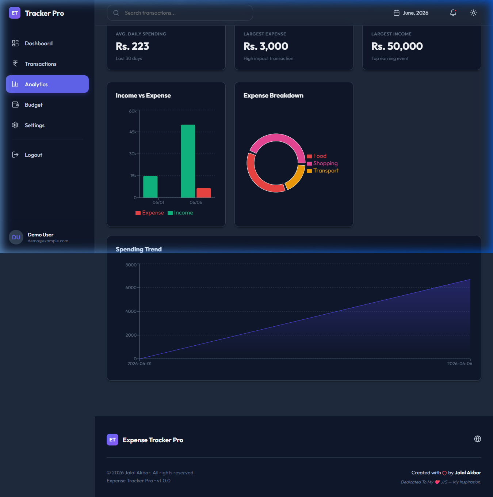
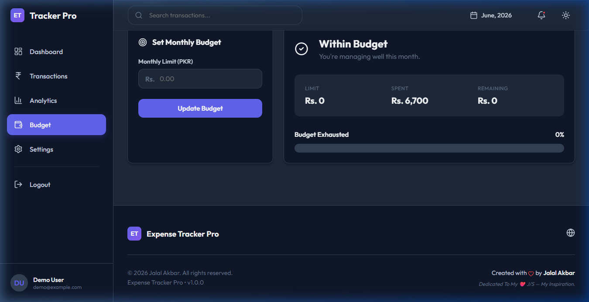
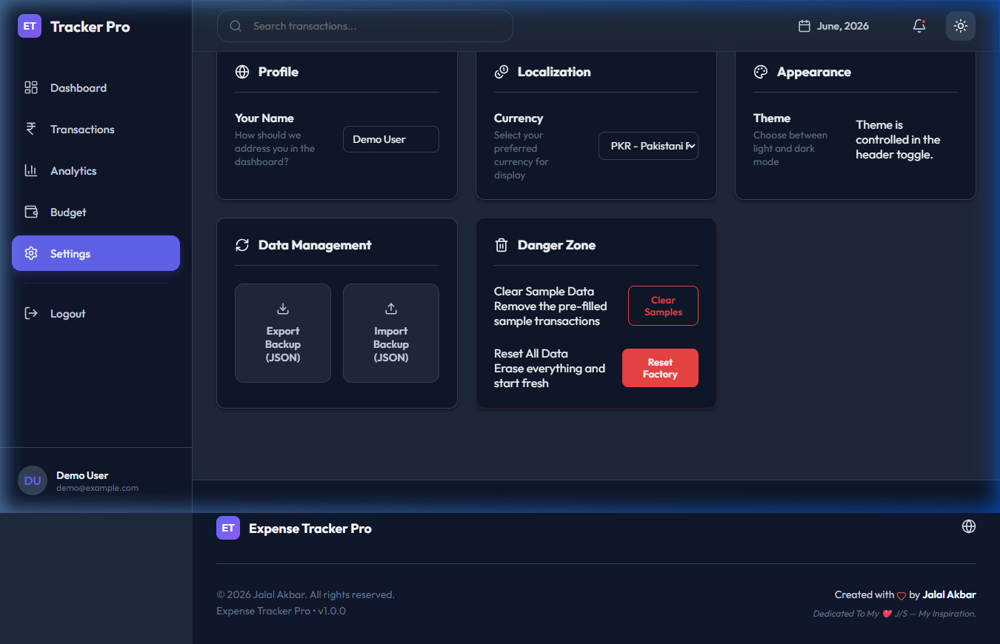

# Expense Tracker Pro 🚀

> A premium, multi-user personal finance SaaS dashboard built with **React.js + Vite**.

---

## 📸 App Showcase

### 🔐 Authentication

| Login | Register |
|-------|----------|
|  |  |

---

### ☀️ Light Mode

| Dashboard | Transactions |
|-----------|--------------|
|  |  |

| Analytics | Budget |
|-----------|--------|
|  |  |

| Settings |
|----------|
|  |

---

### 🌙 Dark Mode

| Dashboard | Transactions |
|-----------|--------------|
|  |  |

| Analytics | Budget |
|-----------|--------|
|  |  |

| Settings |
|----------|
|  |

---

## ✨ Features

### 🔐 Multi-User Authentication (New)
- Professional **Login** and **Register** pages with full field validation
- Duplicate email prevention on registration
- Passwords are validated (minimum 6 chars, must match on register)
- Persistent sessions via `localStorage` — users stay logged in across refreshes
- **Data isolation**: each user's transactions, budgets, and settings are stored under their own scoped key (e.g., `etp_transactions_user@example.com`)
- **Try Demo Account** button for instant portfolio previews (`demo@example.com` / `123456`)
- Secure logout from the sidebar

### 📊 Dashboard
- Personalized greeting: *"Welcome back, Jalal Akbar."*
- At-a-glance stats: Balance, Income, Expenses, Savings Rate
- Financial Health Score with live visual indicator
- Recent Transactions widget
- Top Spending Categories breakdown
- Quick Action buttons (Add Income, Add Expense, Set Budget, Export CSV)

### 💸 Transactions
- Add, edit, delete transactions with full details (title, amount, category, date, payment method, notes)
- Search, filter by type, category, date range
- Inline row actions with edit/delete buttons

### 📈 Analytics
- Spending trend charts (line/bar) powered by **Recharts**
- Income vs. Expense comparison
- Category-wise breakdown (pie/donut)
- Custom tooltip on all charts

### 💰 Budget
- Set and update monthly budget target
- Real-time progress bar (safe/danger)
- Status metrics: Spent, Remaining, Budget %, Days left

### ⚙️ Settings
- Change display name, currency, date format
- Export / Import full JSON backup
- CSV export for all transactions
- Clear all data (with confirmation)
- Dark / Light mode toggle

---

## 🛠️ Tech Stack

| Technology | Purpose |
|---|---|
| React 18 + Vite | UI framework & dev server |
| Vanilla CSS (Modular) | Custom design system (`variables`, `globals`, `layout`, `dashboard`, `transactions`, `budget`, `common`, `auth`, `responsive`) |
| Lucide React | Icon library |
| Recharts | Data visualization |
| localStorage | Client-side persistence & auth |

---

## 🏗️ Folder Structure

```
src/
├── components/
│   ├── common/         # Modal, Toast, EmptyState, ThemeToggle
│   ├── dashboard/      # DashboardCards, HealthScore, QuickActions, RecentTransactions, TopCategories
│   ├── layout/         # Header, Sidebar, Footer
│   ├── budget/         # BudgetWidget
│   └── transactions/   # TransactionForm, TransactionDetails, TransactionList
├── data/               # CATEGORIES, sampleData
├── pages/              # AuthPage, DashboardPage, TransactionsPage, AnalyticsPage, BudgetPage, SettingsPage
├── styles/             # variables.css, globals.css, layout.css, dashboard.css,
│                       # transactions.css, budget.css, common.css, auth.css, responsive.css
├── utils/              # localStorage.js, calculations.js, csvExport.js, dateFormatter.js
├── App.jsx
└── main.jsx

screenshots/            # All UI screenshots (light + dark mode)
```

---

## 🚀 Getting Started

1. **Clone the repository**
   ```bash
   git clone <repo-url>
   cd expense-tracker-pro
   ```

2. **Install dependencies**
   ```bash
   npm install
   ```

3. **Run development server**
   ```bash
   npm run dev
   ```

4. **Build for production**
   ```bash
   npm run build
   ```

5. **Try the demo account**
   - Email: `demo@example.com`
   - Password: `123456`

---

## 🔐 Security Note

> **Important**: This application uses a **frontend-only authentication system** for demonstration and portfolio purposes.
> User credentials and data are stored in the browser's `localStorage` — nothing is sent to a server.
> For a production deployment, a secure backend with bcrypt password hashing and JWT-based sessions would be required.

---

## ❤️ Dedication

Designed and built with passion by **Jalal Akbar**.

*Dedicated to my father, **M. Akbar** — the greatest inspiration and support of my journey. This project is a testament to the values and hard work he instilled in me.*

---

## 📄 License

MIT License — Designed with ❤️ for professionals.
